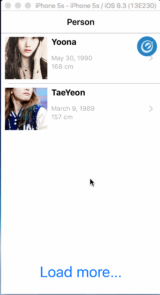

# Project - *Fancy Dating*

** Fancy Dating** app is going to be similar to OKCupid, Mingle, or Skout.
In this app, we going to setup analytics to keep track user experiences.

Time spent: **??** hours spent in total

## User Stories

The following **required** functionality is completed:

- [x] load and show candidates from server (via API)
- [x] support detail page (which shows full screen picture of candidate)
- [x] support load more button
- [x] instrument some basic events
- [x] Summarize results
- [x] Implement an A/B test
- [ ] Moving to a Grid

The following **optional** features are implemented:

- [ ] List anything else that you can get done to improve the app functionality!

The following **additional** features are implemented:

- [ ] List anything else that you can get done to improve the app functionality!

## Video Walkthrough

Here's a walkthrough of implemented user stories:

GIF created with [LiceCap](http://www.cockos.com/licecap/).

## Notes

Describe any challenges encountered while building the app.

## License

    Copyright [2016] [Dang Quoc Huy]

    Licensed under the Apache License, Version 2.0 (the "License");
    you may not use this file except in compliance with the License.
    You may obtain a copy of the License at

        http://www.apache.org/licenses/LICENSE-2.0

    Unless required by applicable law or agreed to in writing, software
    distributed under the License is distributed on an "AS IS" BASIS,
    WITHOUT WARRANTIES OR CONDITIONS OF ANY KIND, either express or implied.
    See the License for the specific language governing permissions and
    limitations under the License.
